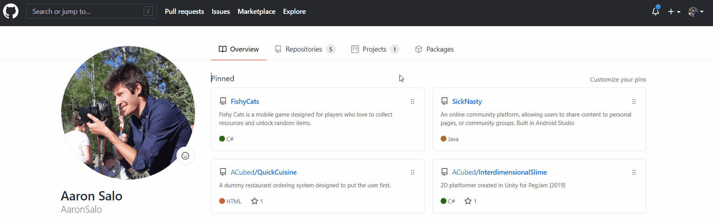
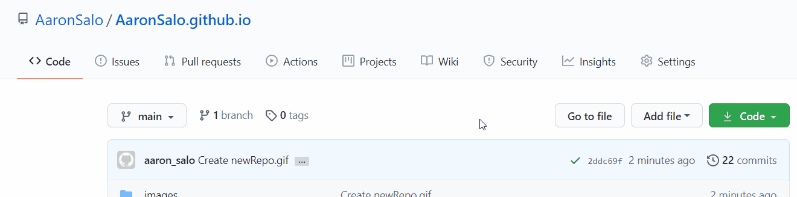
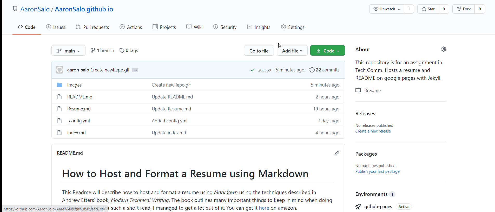
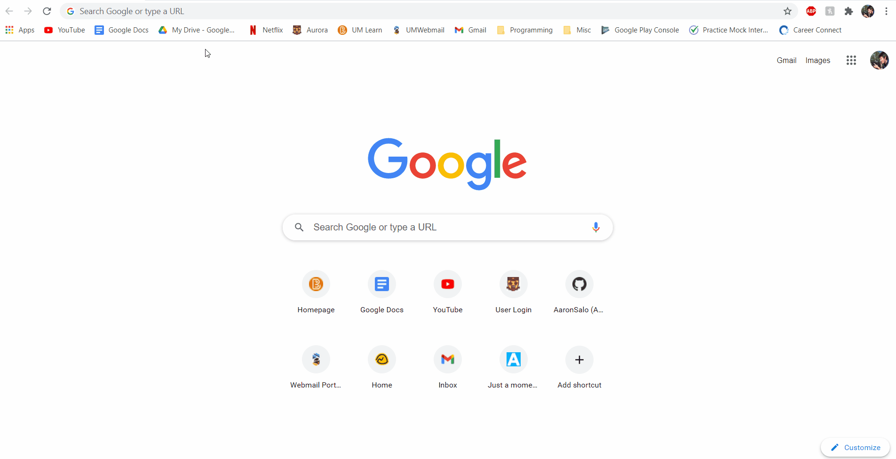

# How to Host and Format a Resume using Markdown
This Readme will describe how to host and format a resume using _Markdown_ using the techniques described in Andrew Etters' book, _Modern Technical Writing_. The book outlines many important things to keep in mind when doing technical writing. For such a short read, I managed to get a lot out of it. You can get it [here](https://www.amazon.ca/Modern-Technical-Writing-Introduction-Documentation-ebook/dp/B01A2QL9SS#:~:text=Written%20by%20the%20lead%20technical,and%20experienced%20technical%20writers%20alike.) on amazon. Some of the things discussed are a lot of benefits to using a static site as opposed to a dynamically generated one. First and formost is simplicity. You don't have to do _any_ coding to get a static site up and running, and you can use this to keep people informed on the latest version of your resume, or other important documents.

>**Before Starting**  
> Before actually starting anything, make sure to have;
> * Familiarity with [Markdown](https://www.markdowntutorial.com/)
> * Your resume formatted in Markdown
> * A GitHub account

## Markdown
First things first; it's important to know how to use Markdown before actually writing anything using it. Don't worry, Markdown is extremely simple, and you can learn all the basics in 5-10 mins. I recommend using an online tutorial like [this one.](https://www.markdowntutorial.com/).

Once you have the basics down, you can use any markdown editor to visualize your work (and make sure you're doing everything correctly). There are many editors out there, as well as extentions you can get for popular code editors such as Visual Studio Code, but [here's](https://stackedit.io/) a great one you can use right in your browser.

## Hosting our Resume
After learning how Markdown works, and writing a nice, clean resume using it, we can finally move into _hosting_ that resume using GitHub Pages. The process is rather simple, and looks very professional given the work taken to do it.

### Step 1: Create a New Repo
First, we need to create a new repository on GitHub, naming it `YourUserName/github.io`. 

 
 
 

### Step 2: Create an `index.md`
Next we can add an index.md to the repository, and give it a couple lines of test text. This is the default page for your GitHub webpage.

   

### Step 3: Choose a Theme!
Finally, we can add a theme to our site to make it look all pretty. From your repo, click on settings, then just scroll down to the GitHub Pages section, and click `Change theme`. Just choose a theme that you like, and it will automatically generate your site using that theme.

   

### We're Done!
We're done! You can access the page at `yourUserName/github.io`, and it should show anything you put into your `index.md` formatted with the theme you chose. Now all you really have to do is paste your Markdown formatted resume in, or whatever else you want to host there. And... _Voila!_

   

### FAQ 
> **Why use Markdown over a word processor?**  
> The reason we use Markdown is because it's quick and fast. We can easily write without worrying too much about how things are laid out, because Markdown does it all for us. Its also easily readable whether we have a program that can read it or not. The source "code" already gives the impression of formatting.

>**Why even host my resume on a website in the first place?** 
> Hosting our resume on a webpage allows us to update the page at any time, and anyone who views it will be seeing the most correct and most up to date version. Like Andrew Etter said in [his book](https://www.amazon.ca/Modern-Technical-Writing-Introduction-Documentation-ebook/dp/B01A2QL9SS#:~:text=Written%20by%20the%20lead%20technical,and%20experienced%20technical%20writers%20alike.) "Hosting your content on a website gives you the power to fix inaccuracies almost instantly _and_ keep you content in sync with the latest (software) release."

>**Why isn't my resume showing up?** 
> If you just created everything, give it a couple minutes; it might take a while for it to update the pages content. If it still isn't working, try going through this tutorial again, making sure you didn't miss a step, and also that you're actually going to the right URL.

  
Notes on the design of this Tutorial

  
*The design of this tutorial was based on a subject called Basic Functional Documentation, talked about in [Andrew Etters book](https://www.amazon.ca/Modern-Technical-Writing-Introduction-Documentation-ebook/dp/B01A2QL9SS#:~:text=Written%20by%20the%20lead%20technical,and%20experienced%20technical%20writers%20alike.). I have tried to answer all the questions brought up in this section, so as to convey the information in the best way possible. We are also assuming some sort of technical knowledge in the reader, and not explaining so much as to how to do the specifics of converting their resume to Markdown. This leaves us with a cleaner, and more consise rundown.*

### Resources
* Andrew Etter - Modern Technical Writing: An Introduction to Software Documentation[here](https://www.amazon.ca/Modern-Technical-Writing-Introduction-Documentation-ebook/dp/B01A2QL9SS#:~:text=Written%20by%20the%20lead%20technical,and%20experienced%20technical%20writers%20alike.)
* Markdown Tutorial [here](https://www.markdowntutorial.com/)
* Screen to gif [here](https://www.screentogif.com/)

### Acknowledgements
Jekyll Theme: Time Machine
Peer Review: 
Kyle Lamoureux  
Kevin Davis 
Tianlei Wang  
Sheikh Shafayet Hossain

